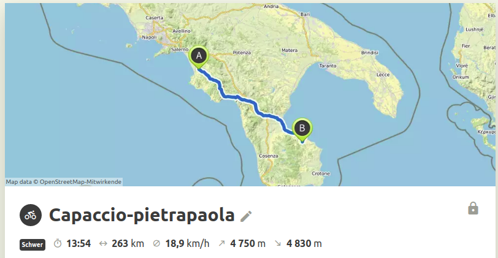
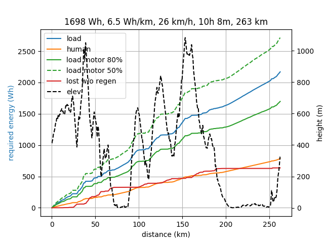

# ebikesimulator
How much energy is required for this track?

Look at [range_calculator.ipynb](range_calculator.ipynb) to see what I mean.

It reads gpx track (must have elevation) and calculate energy requirements.
For instance from a trip planned with Komoot:

this is one of the outputs, using:
- 100kg weight
- 100W human power
- 250W motor power most of the time, with 80% efficiency
- speed between 10 and 32 km/h 
- CdA = 0.5 for air drag, and Crr = 0.005 for rolling friction 

Note the "balance" speed is calculated for constant power human + motor x efficiency, but within imposed bounds, energy available for "regen" braking calculated for negative load (when regen efficiency is similar to motor efficiency 80% at best)

Disclaimer
----------
- It is not tested (yet) against real data, especially needed are data w.r.t real motor efficiency.
- At this point the repository is used by myself to know which ebike system/battery packs to use, and put here for sharing with friends/interested people, it is not a user-friendly tool. It is a bunch of jupyter notebooks, but it could be improved and organized in an online tool like https://www.ebikes.ca/tools/simulator.html

